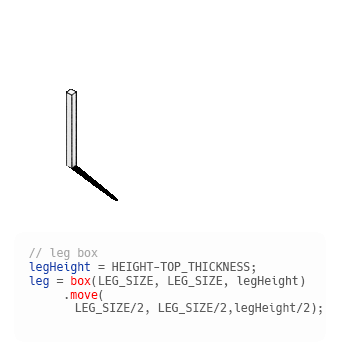
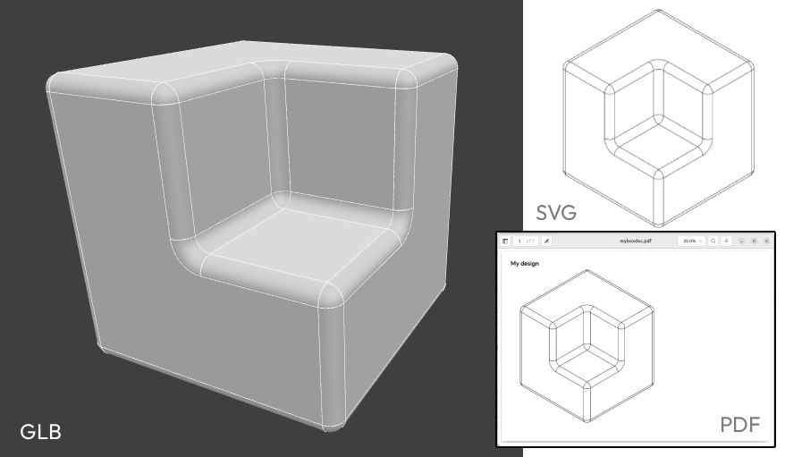

# Archiyou


Archiyou is an online platform and Typescript/Javascript library to codify design and building know-how and publish it online. 
Use our editor and community platform for free at [Archiyou.com](https://archiyou.com).

[](https://github.com/ArchiyouApp/archiyou-core/actions/workflows/build.yml)

## Example

This is a script on our platform:



```js
// Parameters
WIDTH = 100;
DEPTH = 80; 
HEIGHT = 70;

legHeight = HEIGHT-TOP_THICKNESS;
leg = box(LEG_SIZE, LEG_SIZE, legHeight)
        .move(LEG_SIZE/2, LEG_SIZE/2,legHeight/2); // start position of leg
     
legs = leg.array([2,2],[WIDTH-LEG_SIZE,DEPTH-LEG_SIZE])
         .color('green');

top = boxbetween(
    [0,0,legHeight],
    [WIDTH, DEPTH, HEIGHT])
    .color('green');

top.fillet(1,'Face||top'); // finish table top

```

## Core Library Features

* Minimal object-orientated API that feels like descripting your shape. 
* A lot of modeling techniques with our BREP and mesh kernel: CSG, 2D Sketch, surface modeling
* Exports: BREP, STEP, GLTF/GLB, DXF, PDF, Excel etc
* Generate documentation: spec sheets, plans, instructables
* Connected CAD: Import assets (SVG, JPG) from the web and use for modeling
* Assemble models by using scripts as components
* More then a model: Manage data, pipelines, components and outputs
* Publish your script as parametric model in a configurator and serve to the web

## Platform Features

* [Free Editor](https://editor.archiyou.com)
* Open Design: Share scripts and build upon others
* Project management [Coming]

## Developer Quickstart

To use Archiyou as a module to generate designs and documentation independently from our platform it's available as module on npm. 

```bash
# install with any package manager
pnpm add archiyou
npm add archiyou
yarn add archiyou
```

Now run this script in the browser or node:

```js
import { init, Brep, Doc } from 'archiyou'

await init();

const brep = new Brep();

const myModel = brep.Box(100)
    .subtract( // subtract a box from the main box
        brep.Box(50,50,100)
        .move(25,-25,50)
        .hide()
    ).fillet(5); // Give it round edges

await myModel.save('mybox.glb')

const myIso = myModel.iso([1,-1,1])
myIso.save('myboxiso.svg');  // export as SVG file

const myDoc = new Doc() // Doc module
                .create('myDoc') // start a new document (and first page)
                .page('myPage')
                .text('My design')  // place text
                .view('iso', myIso); // place view of myIso shapes

await myDoc.save('myboxdoc.pdf');
```


## Starter templates for your framework

For starter-templates for some popular frameworks and build stacks see /examples/templates

* [Node starter template](/examples/templates/node)
* [Nuxt3+](/examples/templates/nuxt)
* TODO: React
* TODO: Next


If your framework is not present, just look at the others for inspiration. Modern ones work most of the time with the same methods. Contributions are welcome. 

## Notes on the wasm file

Archiyou is a TS/JS layer on top of a WASM build of [OpenCascade](https://github.com/Open-Cascade-SAS/OCCT). 
You application needs to be able to find the WASM file for it to work. If you experience errors during import or execution this is most probably the cause.  


## Run scripts from Archiyou platform independently

If you want to execute scripts (either locally or on a server like Archiyou) and get certain outputs use the Runner. You can also use the Runner to execute scripts in a Webworker. 


```ts 
    import { Runner } from 'archiyou'
    // A runner executes Archiyou scripts
    const runner = new Runner()

    // First a Runner needs to load (because it uses WASM)
    runner.load().then(async (runner) => 
    {
         // Then you execute a script in the default scope
         const r = await runner.execute({ 
                     code: `b = box($SIZE)`, 
                     params: { SIZE: 100 } }, 
                     { formats: ['glb'] }
                  ); 
         const glb = r?.meshGLB; // The 3D model mesh in GLB format (default)
         console.log(`Generating a GLB box took: ${r.duration} ms`);
    });

```

Runner also offers easy ways to execute scripts in a Webworker.

## Examples and use cases

TODO
(links to examples/scripts and editor links)